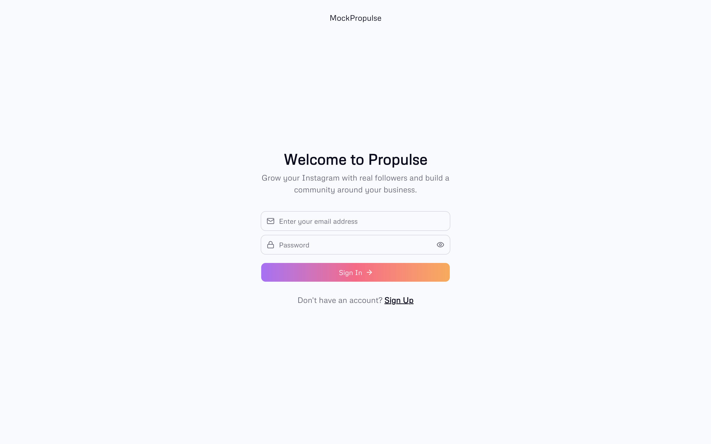
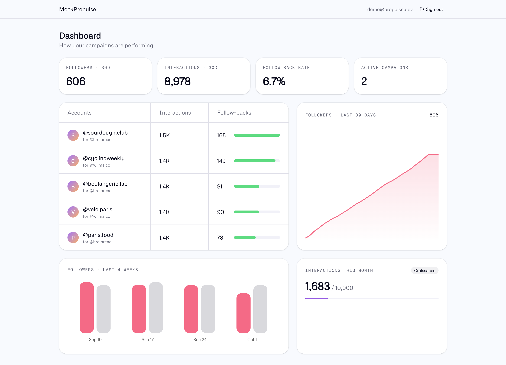

# Mock Propulse

A mock dashboard for Instagram growth campaigns. It shows each campaign's interactions, follow-backs, follower growth and the plan's monthly interaction quota.

It doesn't link to Instagram, and you can't create campaigns from the app. All data, including campaigns, target accounts and daily results, comes from the seed ([supabase/seed.sql](supabase/seed.sql)).

Built with Next.js 16 (App Router), React 19, Tailwind CSS 4, shadcn/ui, Recharts and Supabase (Postgres, Auth, Row Level Security).

## Screenshots

| Login | Dashboard |
| --- | --- |
|  |  |

## Prerequisites

- Node.js 20+
- pnpm (the version is pinned in `package.json`; run `corepack enable` to use it)
- Docker, which the Supabase CLI needs to run the local stack

The Supabase CLI is a dev dependency, so you don't need a global install.

## Installation

```bash
# 1. Install dependencies
pnpm install

# 2. Create your env file
cp .env.example .env.local

# 3. Start the local Supabase stack (Postgres, Auth, Studio…)
pnpm db:start
```

`pnpm db:start` prints the local credentials when it's ready. You can print them again any time with `pnpm db:status`. Copy them into `.env.local`:

| Variable | Value from `db:status` |
| --- | --- |
| `NEXT_PUBLIC_SUPABASE_URL` | API URL (default `http://127.0.0.1:54321`) |
| `NEXT_PUBLIC_SUPABASE_PUBLISHABLE_KEY` | Publishable key |

Then set up the database and start the app:

```bash
# 4. Apply migrations and load demo data
pnpm db:reset

# 5. Run the dev server
pnpm dev
```

Open [http://localhost:3000](http://localhost:3000) and sign in with the demo account:

- **Email:** `demo@propulse.dev`
- **Password:** `password123`

The seeded account is on the *Croissance* plan. It has two campaigns and 35 days of results.

## Database scripts

| Script | What it does |
| --- | --- |
| `pnpm db:start` | Start the local Supabase stack in Docker |
| `pnpm db:stop` | Stop the local Supabase stack |
| `pnpm db:status` | Show local URLs and keys |
| `pnpm db:migrate` | Apply pending migrations from `supabase/migrations` |
| `pnpm db:seed` | Run `supabase/seed.sql` against the local database |
| `pnpm db:reset` | Drop the local database, re-apply all migrations, then seed |
| `pnpm db:types` | Regenerate `src/lib/supabase/database.types.ts` from the local schema |
| `pnpm db:test` | Run the pgTAP tests in `supabase/tests` |

> **Note:** the seed inserts fixed IDs, so `pnpm db:seed` works only on an empty database. To start over, use `pnpm db:reset`.

To add a schema change, create a migration with `pnpm exec supabase migration new <name>`. Apply it with `pnpm db:migrate`, then run `pnpm db:types`.

## Other scripts

| Script | What it does |
| --- | --- |
| `pnpm dev` | Start the Next.js dev server |
| `pnpm build` | Build for production |
| `pnpm start` | Serve the production build |
| `pnpm lint` | Run ESLint |

## Project structure

```
src/
  app/
    (dashboard)/     Authenticated dashboard (route group)
    auth/            Login, sign-up and the OAuth/email callback route
  components/ui/     Shared UI primitives (shadcn/ui)
  features/
    auth/            Server actions and auth form
    dashboard/       Dashboard queries, types and widgets
  lib/supabase/      Supabase clients (browser, server, proxy) and generated types
  proxy.ts           Session refresh and route protection
supabase/
  migrations/        Schema: plans, profiles, campaigns, daily results, quota, dashboard views
  seed.sql           Demo user and data
  tests/database/    RLS and quota tests
```
